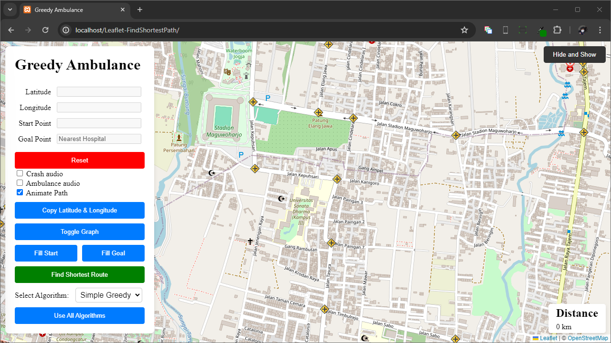
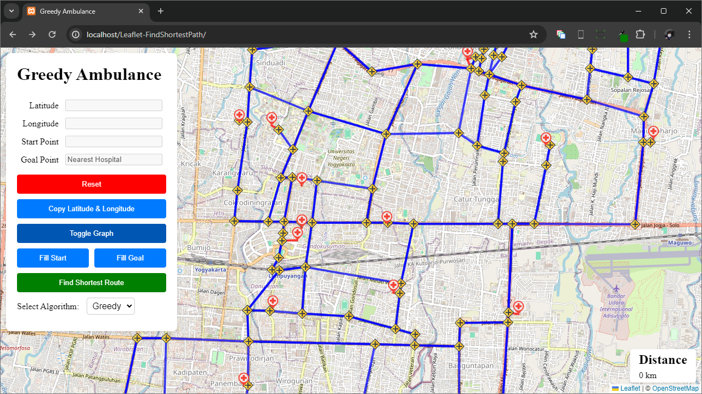
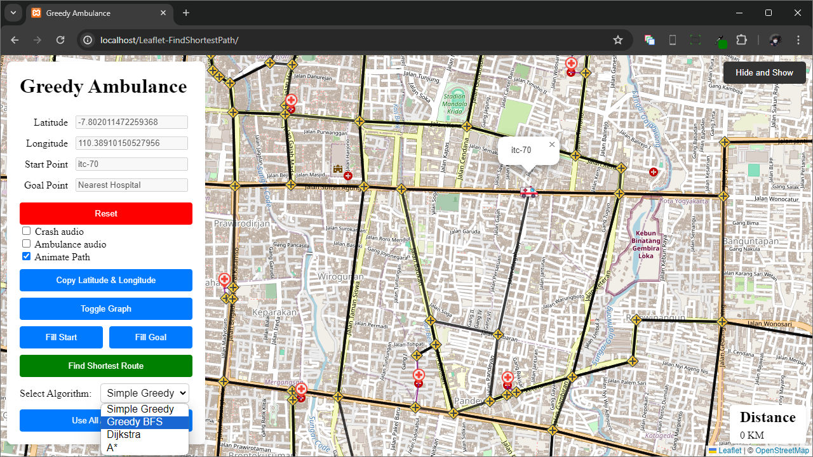
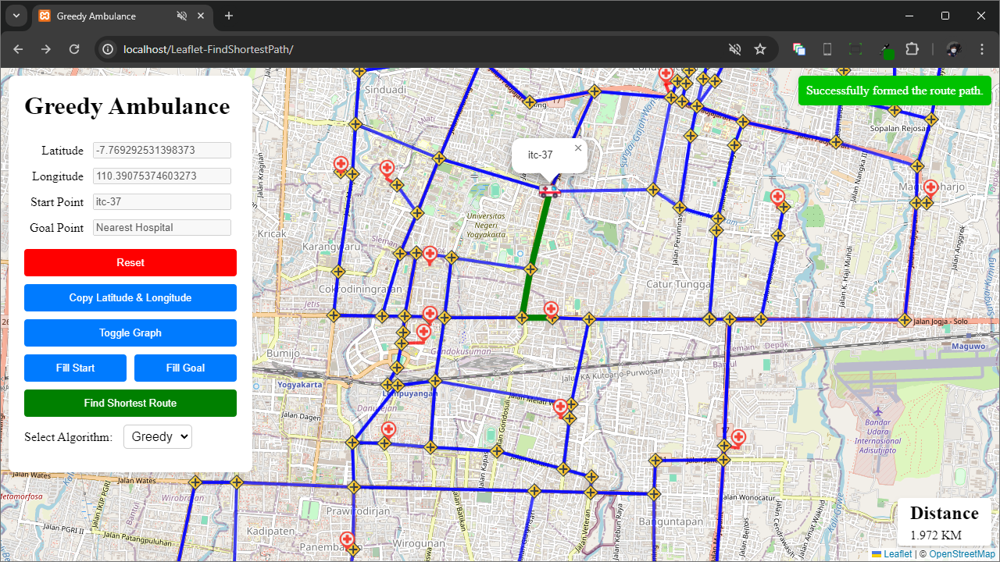
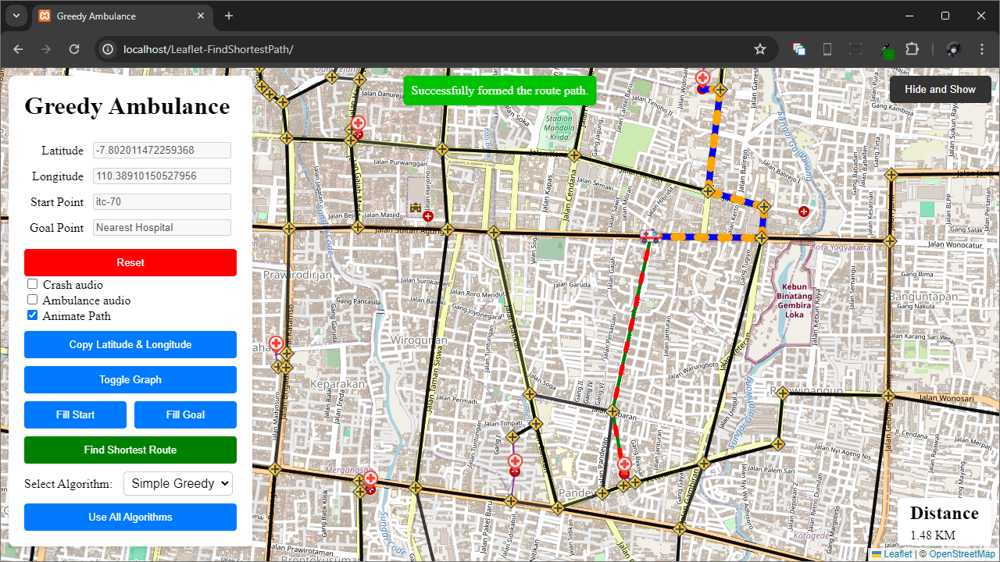

# Greedy Ambulance

This is a project for "Algorithm Strategy Analysis" course.
The name itself came from the title of our paper, which analyzes how greedy algorithm works on closed graph map.
The application visualize how the four shortest path finder algorithms work. 
It uses object oriented approach using Graph and predefined Vertex points using JavaScript.
The graph lines are drawn over Yogyakarta, Indonesia using [Open Street Map](https://www.openstreetmap.org/).

## Features

- Four different algorithms:
  - Greedy (Cheapest Nearest Neighbors)
  - Best First Search (backtracking)
  - Dijkstra
  - A-star (heurstic approach)
- Latitude and Longitude viewer with clipboard copy
- Graph lines toggle buttons
- Start and Goal point input
- Start algorithm with selected algorithm and see total distance in kilometers

## Website Preview

If no goal point was specified, the website passes `null` to the algorithm and finds the nearest hospital vertex.

- **Main page** 
  
- **Toggling predefined graph** 
  
- **Select start/goal vertex** 
  
- **Algorithm selection** 
  
- **Showing the shortest path** 
  
- **Using All Algorithms** 
  

## Installing

1. Clone the repository in htdocs (using XAMPP apache localserver)
2. Open the path to the project 

## Contributors

- [Nara](https://github.com/vianneynara)
- Revin ([NateNats](https://github.com/NateNats))
- [Vito](https://github.com/vincensiusadyatma)
